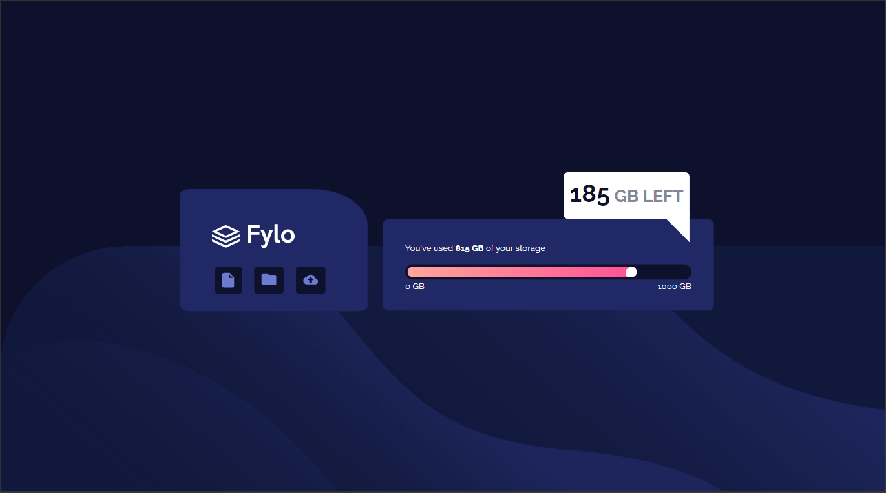
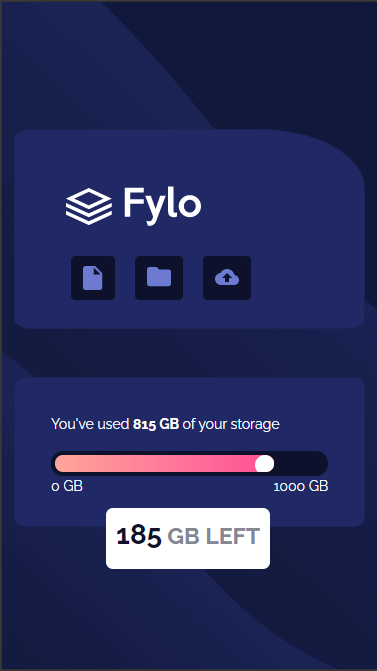

# Frontend Mentor - Fylo data storage component solution

This is a solution to the [Fylo data storage component challenge on Frontend Mentor](https://www.frontendmentor.io/challenges/fylo-data-storage-component-1dZPRbV5n). Frontend Mentor challenges help you improve your coding skills by building realistic projects.

## Table of contents

- [Overview](#overview)
  - [The challenge](#the-challenge)
  - [Screenshot](#screenshot)
  - [Links](#links)
- [My process](#my-process)
  - [Built with](#built-with)
  - [What I learned](#what-i-learned)
  - [Continued development](#continued-development)

## Overview

### The challenge

Users should be able to:

- View the optimal layout for the site depending on their device's screen size (1440px desktop, 375px mobile)

### Screenshots





### Links

- Solution: [GitHub](https://github.com/nkind/flylo-frontend-challenge)
- Live Site: [flylo](https://flylo-frontend-challenge.vercel.app/)

## My Process

### Built with

- [Bootstrap](https://getbootstrap.com/)
- [Sass](https://sass-lang.com/)

### What I Learned

Setup a Sass file for the first time, learned how to watch files `sass --watch styles.scss styles.css` in this case.

Also got to use some of the basic features of Sass with variables and nesting.

Took it as an opportunity to refamiliarize myself with Bootstrap as well.

```scss nesting
.meter {
  background: $darker-blue;
  border-radius: 25px;
  height: 25px;
  padding: 4px;
  position: relative;
  .bar {
    background-image: linear-gradient(
      to right,
      $primary-gradient-one,
      $primary-gradient-two
    );
    border-radius: 8px;
    display: block;
    height: 100%;
    overflow: hidden;
    position: relative;
  }
  .circle {
    background-color: white;
    border-radius: 50%;
    height: 20px;
    left: 95%;
    position: absolute;
    width: 20px;
  }
}
```

### Continued development

Improve the responsive design so the site still looks good when it's not the exact specified sizes for mobile and desktop.
